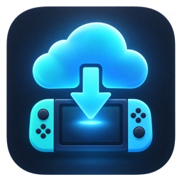
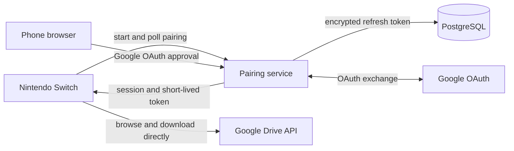

<!-- markdownlint-disable MD033 MD041 -->
<div align="center">



# Switch Drive

*Browse Google Drive and download files directly from a Nintendo Switch.*

[](https://github.com/korefs/switch-drive/actions/workflows/ci.yml)
[](https://github.com/korefs/switch-drive/tags)

[](./LICENSE)

[Features](#features) ·
[Get started](#get-started) ·
[Controls](#controls) ·
[Self-host](#self-host-the-pairing-service) ·
[Build](#build-and-test)

</div>
<!-- markdownlint-enable MD033 MD041 -->

Switch Drive is an early-stage Nintendo Switch homebrew app for read-only access
to Google Drive. Pair an account with a phone, browse **My Drive** or **Shared
with me**, and save files directly to the microSD card. Supported packages can
also be installed from the console.

> [!IMPORTANT]
> NSP and NSZ operations require an Atmosphère console running Switch Drive in
> application mode. Only install packages you trust and are authorized to use.

## Features

- Phone-based Google OAuth pairing with a QR code or short URL and six-digit
  code—no Google credentials are entered on the Switch.
- Direct downloads from Google Drive to
  `sd:/switch-drive/downloads/<task-id>/<filename>`; file contents never pass
  through the pairing service.
- Safe resume after interruption, guarded by Drive revision, ETag, HTTP range,
  expected size, and MD5 metadata when Google provides it.
- Files of 4 GiB or more stored as native HOS concatenated files, avoiding the
  FAT32 per-file limit while preserving one logical filename on the Switch.
- Standalone NRO installation and transactional NSP/NSZ installation for one
  base game, update, or DLC per package.
- Downgrade protection, selectable SD/internal installation storage,
  interrupted-install recovery, and managed component removal that preserves
  save data.
- Local download library with optional package cleanup after installation.
- Controller and touch navigation in English (US), Portuguese (Brazil), and
  Spanish.
- Two interchangeable self-hosted pairing services: Node.js/Docker or
  Cloudflare Workers.

### File support

| Type | Download | Install | Notes |
| --- | :---: | :---: | --- |
| `.nro` | Yes | Yes | Standalone app in `sd:/switch/<app-name>/` |
| `.nsp` | Yes | Yes | One base game, update, or DLC through NCM |
| `.nsz` | Yes | Yes | Streams NCZ into NCM; no intermediate NSP |
| `.xci`, `.zip`, and other files | Yes | No | Stored as regular downloads |
| Native Google documents | No | No | Metadata only; no export |

> [!NOTE]
> Large-file support requires HOS 4.0.0 or later. On a FAT32 card viewed outside
> HOS, a concatenated file appears as a directory containing numbered segments.
> Keep that directory intact.

## How it works



The pairing service holds the Google refresh token and returns a short-lived
Drive access token to the console. The console then lists and downloads content
directly from Google over HTTPS.

## Get started

### Requirements

- A Nintendo Switch capable of running homebrew with
  [Atmosphère](https://github.com/Atmosphere-NX/Atmosphere).
- A FAT32 or exFAT microSD card. FAT32 is recommended for homebrew setups.
- A public HTTPS hostname for the pairing service.
- A Google Cloud OAuth 2.0 web client with the Google Drive API enabled.
- A built `switch-drive.nro`, or the devkitPro toolchain to create it.

### 1. Configure Google OAuth

1. Enable the Google Drive API in a Google Cloud project.
2. Configure the OAuth consent screen. While the app is in testing mode, add
   each user as a test user.
3. Create an OAuth 2.0 **Web application** client.
4. Register this exact redirect URI, replacing the hostname:

   ```text
   https://drive.example.com/oauth/google/callback
   ```

> [!NOTE]
> External OAuth apps in testing mode are limited to approved test users, and
> their refresh tokens expire after seven days. The requested `drive.readonly`
> scope is restricted, so review Google's
> [OAuth production requirements](https://developers.google.com/identity/protocols/oauth2/production-readiness/overview)
> and [Drive scope guidance](https://developers.google.com/workspace/drive/api/guides/api-specific-auth)
> before distributing a public deployment.

### 2. Deploy the pairing service

The quickest local-server deployment uses Docker Compose with PostgreSQL and
Caddy:

```sh
cp server/.env.example server/.env
# Edit server/.env with the public hostname, OAuth client, and random secrets.
docker compose --env-file server/.env up --build -d
```

Set `PUBLIC_ORIGIN` to the HTTPS origin used in Google Cloud and `PUBLIC_HOST`
to the hostname only. Generate `TOKEN_ENCRYPTION_KEY` and `COOKIE_SECRET` as
shown in `server/.env.example`, and choose a separate long random PostgreSQL
password. Caddy obtains and renews the TLS certificate.

Confirm the public endpoint before configuring the console:

```sh
curl https://drive.example.com/health
```

For the serverless alternative, follow the
[Cloudflare Worker deployment guide](./worker/README.md).

### 3. Prepare the SD card

Copy the NRO and create the service configuration:

```text
sd:/
├── switch/
│   └── switch-drive/
│       └── switch-drive.nro
└── switch-drive/
    └── config.json
```

`config.json` must contain the public HTTPS origin in this compact form:

```json
{"service_url":"https://drive.example.com"}
```

Launch Switch Drive from Sphaira or hbmenu. Use a title override—hold **R**
while opening a game—for NSP/NSZ installation and removal. Browsing and regular
downloads remain available in applet mode, where the app displays a warning.

### 4. Pair and download

1. Choose **Connect Drive**.
2. Scan the QR code, or open the displayed URL and enter its six-digit code.
3. Approve read-only Drive access, return to the Switch, and press **A** to
   check the pairing.
4. Open **Files**, select a file, then press **X** to download or **Y** to
   download and install.

Pairing requests expire after ten minutes. Connecting another account makes it
the active account; a full account switcher is not implemented yet.

## Controls

| Input | Action |
| --- | --- |
| D-pad or either stick | Move the selection; hold to repeat |
| **A** | Activate; open a folder; install a Library NSP/NSZ |
| **B** | Go back; pause/cancel an active network operation |
| **X** in Files | Download the selected file |
| **Y** in Files | Download and install the selected file |
| **X** in Library | Confirm uninstall of a managed NSP component |
| **Y** in Library | Delete the package or offer managed uninstall |
| **L/R** | Change the main section |
| **L** while browsing | Toggle **My Drive** and **Shared with me** |
| **Y** in Settings | Cycle `en-US` → `pt-BR` → `es-ES` |
| **+** | Exit |
| Touch | Select tabs, cards, and rows; tap again to activate; swipe to scroll |

## Self-host the pairing service

The service requests only `drive.readonly` and identity scopes. It provides:

- ten-minute, attempt-limited pairings with one-time claims;
- 180-day console sessions stored as hashes;
- AES-256-GCM encryption for Google refresh tokens at rest;
- short-lived Drive access tokens for linked consoles;
- per-route and global rate limiting; and
- automatic PostgreSQL schema creation.

The REST contract is documented in [the OpenAPI specification](./docs/openapi.yaml).

> [!WARNING]
> Never commit `server/.env`, OAuth credentials, `state.json`, or `boot.log`.
> Do not expose the Docker PostgreSQL port directly to the internet. Use the
> included Caddy service or a managed PostgreSQL database with the Worker.

## Build and test

### Switch client

Install devkitPro with `switch-dev`, `switch-curl`, `switch-mbedtls`,
`switch-zstd`, `switch-jansson`, `switch-sdl2`, and `switch-sdl2_ttf`, then run:

```sh
make
python3 tests/check_nro.py switch-drive.nro
```

The packaging check verifies the NRO header and its embedded icon, NACP, and
RomFS assets.

### Portable C++ tests

The host suite covers state migration and atomic persistence, resumable logical
files, safe package removal, PFS0/CNMT/NCZ parsing, download range validation,
localization, QR generation, and UI navigation models.

```sh
cmake -S tests -B build/tests
cmake --build build/tests
ctest --test-dir build/tests --output-on-failure
```

The host needs CMake 3.24+, a C++20 compiler, zstd, and mbedTLS crypto headers
and libraries.

### Optional UI preview and runtime simulation

Install host SDL2, SDL2_ttf, and pkg-config, then configure either option:

```sh
cmake -S tests -B build/preview \
  -DSWITCHDRIVE_UI_PREVIEW=ON \
  -DSWITCHDRIVE_UI_RUNTIME_TESTS=ON
cmake --build build/preview
SWITCHDRIVE_PREVIEW_FONT=/path/to/font.ttf ctest --test-dir build/preview --output-on-failure
SWITCHDRIVE_PREVIEW_FONT=/path/to/font.ttf build/preview/switch_drive_ui_preview
```

Preview images are written to `build/ui-preview/`. These tests exercise the
real renderer with host or simulated services; they do not emulate Switch HID,
the compositor, memory limits, or NCM permissions.

### TypeScript services

The Docker service requires Node.js 24 or later. The Worker uses Wrangler 4.

```sh
cd server
npm ci
npm run build

cd ../worker
npm ci
npm run check
```

## Safety and recovery

- State writes use temporary files, backups, and atomic replacement.
- Downloads checkpoint committed data and reject unsafe HTTP range responses or
  changed Drive revisions before resuming.
- NSP/NSZ mutations are journaled before NCM changes. On the next launch, the
  app checks live metadata and either completes or rolls back recovery.
- Existing content remains registered until replacement metadata commits.
- Managed removal deletes only the selected base, update, or DLC component
  after orphan checks. Switch Drive never calls save-data deletion APIs.
- Package cleanup happens only after a confirmed installation.

Package signature verification is not implemented yet. Atmosphère and the
appropriate FS patches remain the operator's responsibility.

## Troubleshooting

- **Configuration missing:** verify that
  `sd:/switch-drive/config.json` uses the exact compact JSON shown above and an
  HTTPS origin without an API path.
- **Install controls unavailable:** relaunch through a full title override by
  holding **R** while opening a game.
- **Pairing stops working after several days:** reconnect the account and check
  whether the Google consent screen is still in testing mode.
- **Interrupted download:** select the same Drive file again. Switch Drive will
  offer Resume only when its saved identity and partial data are consistent.
- **Startup or input problem:** preserve `sd:/switch-drive/boot.log` immediately
  after the failed attempt; each launch replaces it. Include Switch firmware,
  Atmosphère, Sphaira/hbmenu, launch mode, and microSD filesystem in the report.

## Project structure

| Path | Purpose |
| --- | --- |
| `switch/` | C++20 client, UI, networking, downloader, and installers |
| `server/` | Fastify pairing/OAuth service for Docker deployments |
| `worker/` | Cloudflare Worker implementation of the same pairing API |
| `tests/` | Portable core, UI model, renderer, and NRO packaging checks |
| `docs/openapi.yaml` | Pairing service API contract |
| `deploy/` | Caddy reverse-proxy configuration |
| `third_party/Goldleaf/` | Pinned Goldleaf reference for NCM integration |

The NSP/NSZ installer follows the NCM approach from
[Goldleaf](https://github.com/XorTroll/Goldleaf). NCZ streaming implements the
public [NSZ format](https://github.com/nicoboss/nsz/blob/master/docs/formats.md)
with zstd and AES-CTR; this project does not ship console keys or copyrighted
content.
