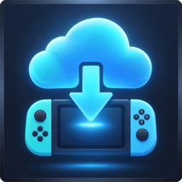
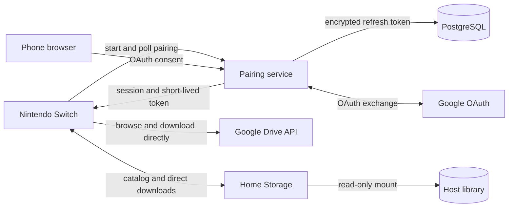

<!-- markdownlint-disable MD033 MD041 -->
<div align="center">



# Switch Drive

_Browse Google Drive or your own storage from a Nintendo Switch._

[](https://github.com/korefs/switch-drive/actions/workflows/ci.yml)
[](https://github.com/korefs/switch-drive/tags)

[](./LICENSE)

[Features](#features) ·
[Get started](#get-started) ·
[Home Storage](#run-home-storage) ·
[Controls](#controls) ·
[Self-host](#self-host-the-pairing-service) ·
[Build](#build-and-test)

</div>
<!-- markdownlint-enable MD033 MD041 -->

Switch Drive is a Nintendo Switch homebrew app for accessing Google Drive and
self-hosted Home Storage providers. Browse remote folders, save files directly
to the microSD card, and optionally install supported packages from the console.

> [!WARNING]
> Currently under active development. Core features are stable and functional, though you may still encounter minor bugs or UX issues while the project moves toward its first fully validated end-to-end release.

> [!IMPORTANT]
> NSP and NSZ operations require an Atmosphère console running Switch Drive in
> application mode. Only install packages you trust and are authorized to use.

## Features

- Phone-based Google OAuth pairing with a QR code or short URL—no Google
  credentials are entered on the Switch.
- Self-hosted Home Storage providers with LAN discovery, manual addresses,
  optional authentication, and a read-only host library.
- Direct downloads from the selected provider to
  `sd:/switch-drive/downloads/<task-id>/<filename>`; file contents never pass
  through the pairing service.
- Safe resume after interruption, guarded by provider identity, revision, ETag,
  HTTP range, expected size, and MD5 or SHA-256 metadata.
- Files of 4 GiB or more stored as native HOS concatenated files, avoiding the
  FAT32 per-file limit while preserving one logical filename on the Switch.
- Standalone NRO installation and transactional NSP/NSZ installation for one
  base game, update, or DLC per package. **Download and install** streams
  NSP/NSZ content directly into NCM placeholders instead of storing the whole
  package first.
- Downgrade protection, selectable SD/internal installation storage, and
  interrupted-install recovery.
- Local library for downloaded packages. Successfully installed packages are
  deleted automatically; cleanup failures leave them available for manual deletion.
- Controller and touch navigation in English (US), Portuguese (Brazil), and
  Spanish.
- Borealis-based interface with the classic Switch sidebar, native focus and
  footer behavior, automatic light/dark themes, and 1280x720 scaling.
- Two interchangeable self-hosted pairing services: Node.js/Docker or
  Cloudflare Workers.

### File support

| Type | Download | Install | Notes |
| --- | :---: | :---: | --- |
| `.nro` | Yes | Yes | Standalone app in `sd:/switch/<app-name>/` |
| `.nsp` | Yes | Yes | Direct-to-NCM streaming for Download and install |
| `.nsz` | Yes | Yes | Streams and decompresses NCZ directly into NCM |
| `.xci`, `.zip`, and other files | Yes | No | Stored as regular downloads |
| Native Google documents | No | No | Metadata only; no export |

> [!NOTE]
> Large-file support requires HOS 4.0.0 or later. On a FAT32 card viewed outside
> HOS, a concatenated file appears as a directory containing numbered segments.
> Keep that directory intact.

## How it works



The pairing service holds the Google refresh token and returns a short-lived
Drive access token to the console. Google Drive and Home Storage file data flows
directly to the console; Home Storage does not depend on the pairing service.

## Get started

### Requirements

- A Nintendo Switch capable of running homebrew with
  [Atmosphère](https://github.com/Atmosphere-NX/Atmosphere).
- A FAT32 or exFAT microSD card. FAT32 is recommended for homebrew setups.
- A built `switch-drive.nro`, or the devkitPro toolchain to create it.
- For Home Storage: Docker on the computer that hosts the library.

### 1. Prepare the SD card

Copy the NRO to the application folder:

```text
sd:/
└── switch/
    └── switch-drive/
        └── switch-drive.nro
```

The app uses
`https://api.erok.qzz.io` as its Google OAuth pairing API by default. The
pairing API handles authorization and short-lived access tokens; Drive file
contents are downloaded directly from Google to the console.

Launch Switch Drive from Sphaira or hbmenu. Use a title override—hold **R**
while opening a game—for NSP/NSZ installation and removal. Browsing and regular
downloads remain available in applet mode, where the app displays a warning.

### 2. Pair and download

1. Choose **Connect Drive**.
2. Scan the QR code, or open the displayed URL and enter its six-digit code.
3. Approve read-only Google Drive access, return to the Switch, and press
   **A** to check the pairing.
4. Open **Files**, browse **My Drive** or **Shared with me**, select a file,
   then choose **Download** or **Download and
   install** from its action menu.

Pairing requests expire after ten minutes. Connecting another account makes it
the active account; a full account switcher is not implemented yet.

Switch Drive requests `drive.readonly`, plus `openid`, `email`, and `profile`
for account identity. This grants read-only access to all files the connected
Google account can see; the app cannot create, edit, or delete Drive content.
The Drive scope is classified as restricted by Google, so a public OAuth client
requires Google's verification process, including the restricted-scope security
assessment when applicable. Until the built-in service completes that process,
use your own OAuth deployment as described below.

## Run Home Storage

Home Storage is an optional .NET 10 service that exposes a private computer
folder through the same browse, download, resume, and install workflow. The
library is mounted read-only; SQLite stores its catalog and credentials.

```powershell
cd home-storage
Copy-Item .env.example .env
# Set HOST_LIBRARY_PATH and replace SETUP_TOKEN in .env.
docker compose up -d
```

Open `http://localhost:8080/setup`, enter `SETUP_TOKEN`, and create the
administrator and Switch-library credentials. On the Switch, open **Settings →
Home Storage**, then detect the service on the LAN or enter its address
manually.

LAN discovery uses UDP port 8080 and may be blocked by wireless client
isolation. Plain HTTP is appropriate only on a trusted LAN; use HTTPS and Home
Storage authentication for remote access. See the complete
[Home Storage guide](./home-storage/README.md), including the optional
Cloudflare Tunnel setup.

## Security and data handling

The client never stores Google refresh tokens or a Home Storage password. It
stores the console session credential, account IDs, and revocable Home Storage
bearer tokens in `sd:/switch-drive/state.json`. The pairing server encrypts
refresh tokens using `TOKEN_ENCRYPTION_KEY` before writing them to PostgreSQL.
Home Storage hashes passwords and bearer tokens, mounts the host library
read-only, and hides catalog entries only in SQLite. Do not commit `.env`,
console state, logs, OAuth credentials, or tunnel tokens.

## Controls

| Input | Action |
| --- | --- |
| D-pad or either stick | Move the selection; hold to repeat |
| **A** | Activate; open a folder; choose an action for a file; install a Library NSP/NSZ |
| **B** | Go back; pause/cancel an active network operation |
| **X** in Files | Choose the storage provider |
| **Y** in Files | Switch between My Drive and Shared with me |
| **Y** in Library | Delete the downloaded package |
| **L/R** | Change the main section |
| **ZL** in Files | Hide an entry when catalog management is allowed |
| **+** | Exit |
| Touch | Select tabs, cells, and rows; swipe to scroll |

Settings are ordinary cells activated with **A**. Language changes are saved
immediately and applied on the next launch so the Borealis chrome and app text
always use the same locale.

## Self-host the pairing service

You can replace the built-in pairing API with your own deployment. You need a
public HTTPS origin, a Google Cloud OAuth 2.0 web client, and either the included
Docker service or Cloudflare Worker.

### 1. Configure Google OAuth

> [!NOTE]
> *Replace erok.qzz.io and swdrive.erok.qzz.io with your own domain.*

1. Enable the Google Drive API in a Google Cloud project.
2. Configure Google Auth Platform branding and audience. While the app remains
   in **Testing**, every user must be listed as a test user. To remove that
   restriction, select **External** and publish the app to **In production**.
   `drive.readonly` is restricted: production use outside your test-user list
   requires OAuth verification and the restricted-scope security assessment
   when applicable. Publishing the consent screen alone does not bypass review.
   For a personal deployment, keep the project in **Testing** and add only the
   Google accounts that should use it. In a verification request, explain that
   Switch Drive is a user-facing Drive browser/downloader: it must enumerate
   arbitrary nested folders and shared items, while its code performs no Drive
   create, update, or delete operations. A `drive.file` folder grant does not
   reliably authorize the folder's existing descendants, so it cannot provide
   that browsing behavior.
3. Create an OAuth 2.0 **Web application** client.
4. Register this exact redirect URI, replacing the hostname:

   ```text
   https://drive.example.com/oauth/google/callback
   ```

For the official deployment, use these separate public origins:

| Google field | Value |
| --- | --- |
| Application home page | `https://swdrive.erok.qzz.io/` |
| Privacy policy | `https://swdrive.erok.qzz.io/privacy/` |
| Terms of service | `https://swdrive.erok.qzz.io/terms/` |
| Authorized redirect URI | `https://api.erok.qzz.io/oauth/google/callback` |
| Authorized domain | `erok.qzz.io` |

Verify the root domain `erok.qzz.io` as a Search Console Domain property using
the same Google account that owns or edits the Cloud project. The homepage does
not have to live on the API origin: keeping the public site on `swdrive` and the
OAuth callback/API on `api` is the recommended separation.

The dependency-free public site is in [`site/`](./site/README.md). Create a
Cloudflare Pages Git project with no build command, output directory `site`,
then attach `swdrive.erok.qzz.io` as its custom domain.

### 2. Deploy the service

The quickest deployment uses Docker Compose with PostgreSQL and Caddy:

```sh
cp server/.env.example server/.env
# Edit server/.env with the public hostname, OAuth client, and random secrets.
docker compose --env-file server/.env up --build -d
```

Set `PUBLIC_ORIGIN` to the HTTPS origin used in Google Cloud and `PUBLIC_HOST`
to the hostname only. Generate `TOKEN_ENCRYPTION_KEY` and `COOKIE_SECRET` as
shown in `server/.env.example`, and choose a separate long random PostgreSQL
password. Caddy obtains and renews the TLS certificate.

Confirm the public endpoint:

```sh
curl https://drive.example.com/health
```

For the serverless alternative, follow the
[Cloudflare Worker deployment guide](./worker/README.md).

### 3. Select the custom API on the Switch

Open **Settings → Google OAuth Pairing API** and enter the HTTPS origin, without
a trailing API path, for example `https://drive.example.com`. Changing the API
disconnects the current Google account, which must then be paired again against
the new service. Leave the field empty to restore the built-in service.

For compatibility with older releases, a fresh installation can instead use
`sd:/switch-drive/config.json` with this exact compact content:

```json
{"service_url":"https://drive.example.com"}
```

The service requests `drive.readonly` and the OpenID identity scopes. It stores
an encrypted refresh token but does not proxy or store Drive file content. It
provides:

- ten-minute, attempt-limited pairings with one-time claims;
- 180-day console sessions stored as hashes;
- AES-256-GCM encryption for Google refresh tokens at rest;
- short-lived Drive access tokens for linked consoles;
- account disconnection with stored authorization deletion and best-effort
  Google token revocation;
- per-route and global rate limiting; and
- automatic PostgreSQL schema creation.

The REST contract is documented in [the OpenAPI specification](./docs/openapi.yaml).

> [!WARNING]
> Never commit `server/.env`, OAuth credentials, `state.json`, or `boot.log`.
> Do not expose the Docker PostgreSQL port directly to the internet. Use the
> included Caddy service or a managed PostgreSQL database with the Worker.

## Build and test

### Switch client

Clone recursively, then install devkitPro with `switch-dev`, `switch-curl`,
`switch-mbedtls`, `switch-zstd`, `switch-jansson`, and `switch-glm`. The client
uses the Deko3D Borealis backend and no longer depends on SDL2 or SDL_ttf.

```sh
make
python3 tests/check_nro.py switch-drive.nro
```

The root `make` command configures the Switch CMake toolchain, builds Borealis,
packages its shaders/materials/system icons, and still writes
`switch-drive.nro` at the repository root. The packaging check verifies the NRO
header and its embedded icon, NACP, and RomFS assets.

### Portable C++ tests

The host suite covers state migration and atomic persistence, resumable logical
files, safe package removal, PFS0/CNMT/NCZ parsing, download range validation,
localization, QR generation, and UI navigation models.

```sh
cmake -S tests -B build/tests
cmake --build build/tests
ctest --test-dir build/tests --output-on-failure
```

The host needs CMake 3.24+, a C++20 compiler, zstd, and mbedTLS crypto headers
and libraries.

### Optional UI preview

The portable preview produces 1280x720 light/dark samples for all three
languages without requiring Switch services:

```sh
cmake -S tests -B build/preview \
  -DSWITCHDRIVE_UI_PREVIEW=ON
cmake --build build/preview
build/preview/switch_drive_ui_preview build/ui-preview.html
```

Open `build/ui-preview.html` in a browser. It exercises the same immutable UI
models but does not emulate Switch HID, the compositor, memory limits, or NCM
permissions; final acceptance still requires hardware.

### TypeScript services

The Docker service requires Node.js 24 or later. The Worker uses Wrangler 4.

```sh
cd server
npm ci
npm run build

cd ../worker
npm ci
npm run check
```

### Home Storage

Run the .NET test target in Docker:

```sh
cd home-storage
docker build --target test -t switch-drive-home-storage-tests .
```

## Safety and recovery

- State writes use temporary files, backups, and atomic replacement.
- Downloads checkpoint committed data and reject unsafe HTTP range responses or
  changed Drive revisions before resuming.
- Streamed installs validate every exact HTTP range and every reconstructed NCA
  against CNMT hashes. Completed placeholders survive interruptions; only the
  interrupted NCA/NCZ is fetched again when resuming.
- NSP/NSZ mutations are journaled before NCM changes. On the next launch, the
  app checks live metadata and either completes or rolls back recovery.
- Existing content remains registered until replacement metadata commits.
- The Library never removes installed titles or save data; it only deletes
  downloaded package files.
- Package cleanup is always attempted after a confirmed installation. A cleanup
  failure does not turn the installation into a failure and leaves the package in
  the Library for manual deletion.
- Home Storage mounts the host library read-only. Hiding an entry changes only
  its SQLite catalog and never deletes the host file.

Package signature verification is not implemented yet. Atmosphère and the
appropriate FS patches remain the operator's responsibility.

## Troubleshooting

- **Custom pairing API rejected:** enter its HTTPS origin without a path, query,
  fragment, or credentials, for example `https://drive.example.com`.
- **Install controls unavailable:** relaunch through a full title override by
  holding **R** while opening a game.
- **Pairing stops working after several days:** reconnect the account and check
  whether the Google consent screen is still in testing mode.
- **Interrupted download:** select the same Drive file again. Switch Drive will
  offer Resume only when its saved identity and partial data are consistent.
- **Home Storage is not discovered:** check UDP port 8080 and wireless client
  isolation, or enter the HTTP/HTTPS address manually.
- **Startup or input problem:** preserve `sd:/switch-drive/boot.log` immediately
  after the failed attempt; each launch replaces it. Include Switch firmware,
  Atmosphère, Sphaira/hbmenu, launch mode, and microSD filesystem in the report.

## Project structure

| Path | Purpose |
| --- | --- |
| `switch/` | C++20 client, UI, networking, downloader, and installers |
| `server/` | Fastify pairing/OAuth service for Docker deployments |
| `worker/` | Cloudflare Worker implementation of the same pairing API |
| `home-storage/` | .NET 10 service for a private, read-only host library |
| `tests/` | Portable core, UI model, renderer, and NRO packaging checks |
| `docs/openapi.yaml` | Pairing service API contract |
| `deploy/` | Caddy reverse-proxy configuration |
| `third_party/Goldleaf/` | Pinned Goldleaf reference for NCM integration |
| `third_party/borealis/` | Pinned Borealis UI framework and Switch resources |

The NSP/NSZ installer follows the NCM approach from
[Goldleaf](https://github.com/XorTroll/Goldleaf). NCZ streaming implements the
public [NSZ format](https://github.com/nicoboss/nsz/blob/master/docs/formats.md)
with zstd and AES-CTR; this project does not ship console keys or copyrighted
content.
